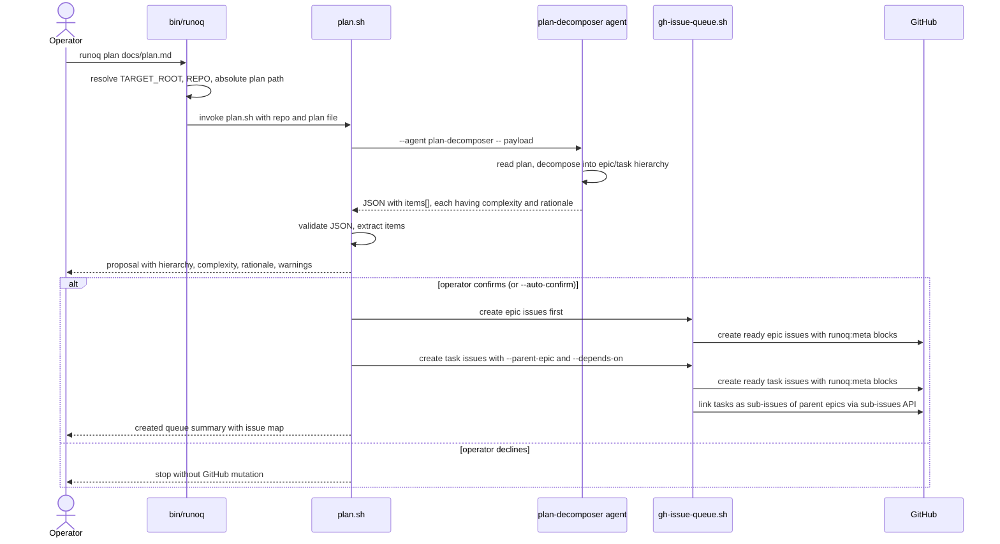
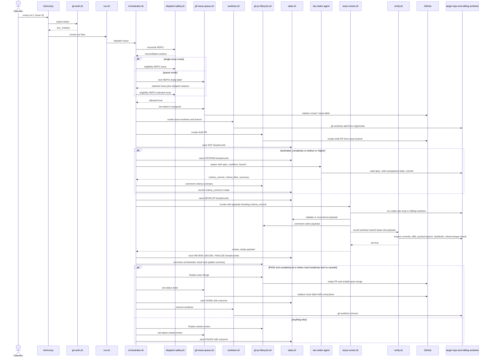
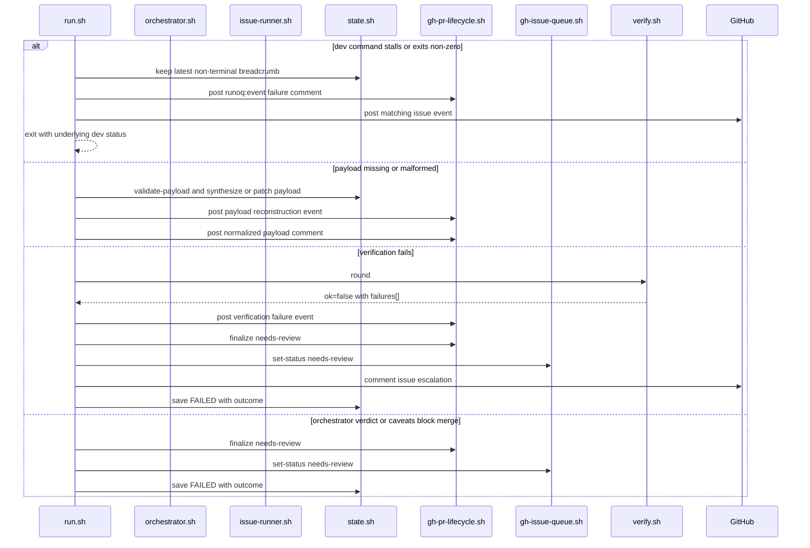
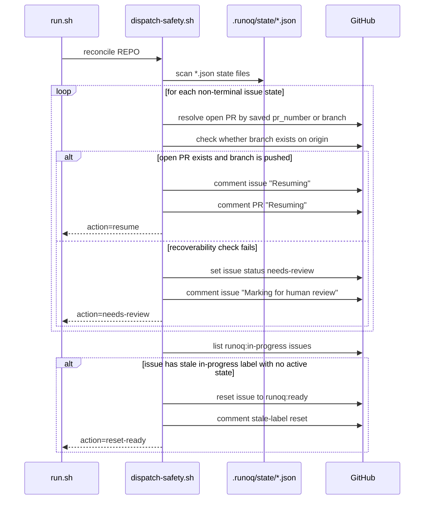
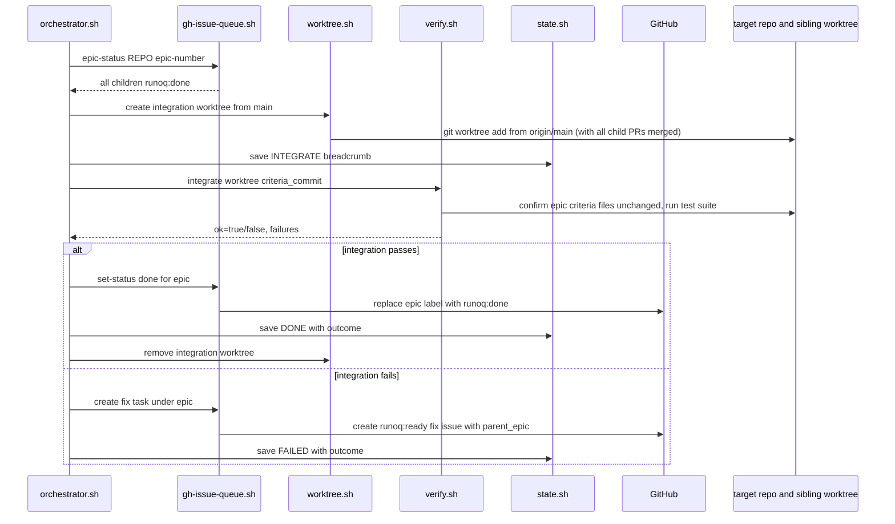
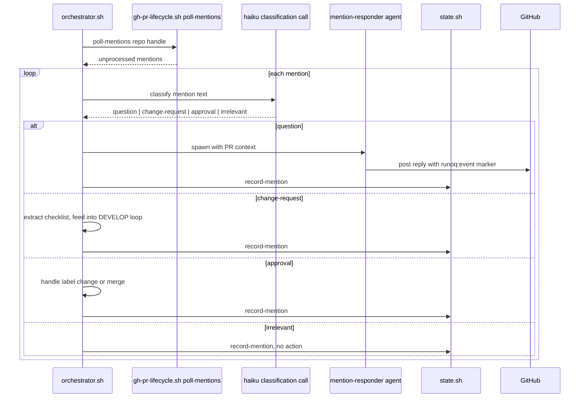

# Execution And Maintenance Flows

This document describes the major runtime sequences in `runoq`: planning, execution, reconciliation, mention handling, and maintenance review.

For `runoq run`, the orchestrator and issue-runner are now shell scripts (`orchestrator.sh` and `issue-runner.sh`), not agents. The orchestrator drives phase transitions (INIT, CRITERIA, DEVELOP, REVIEW, DECIDE, FINALIZE, INTEGRATE), spawns agents for bounded reasoning tasks, and handles mention triage. The issue-runner drives codex rounds within the DEVELOP phase.

## `runoq plan`

`runoq plan <file>` is the plan-decomposition entrypoint. The CLI resolves context, then `scripts/plan.sh` invokes the `plan-decomposer` agent to produce an epic/task hierarchy. Each item receives an `estimated_complexity` and `complexity_rationale`. Issue creation is handled deterministically by `plan.sh` itself (not by the agent), using `gh-issue-queue.sh create`. Epics are created first, then tasks are created and linked as sub-issues via the GitHub sub-issues API.

### Planning decision points

| Decision point | Current behavior |
| --- | --- |
| Plan granularity too broad, too narrow, or untestable | The agent must call that out in warnings before creation |
| User confirmation | No issues are created before explicit confirmation (unless `--auto-confirm`) |
| Issue creation path | `plan.sh` uses `gh-issue-queue.sh create` deterministically, not the agent |
| Epic/task linking | Tasks with a `parent_epic_key` are linked via the GitHub sub-issues API |
| Complexity rationale | Each task receives a `complexity_rationale` explaining the complexity estimate |

## `runoq run` Happy Path

The queue execution flow has two entry modes:

- `runoq run --issue N`: target a single issue directly
- `runoq run`: ask the queue for the next actionable ready issue

The sequence below shows the happy path for one issue after reconciliation succeeds.

### Finalization decision table

| Condition | Outcome |
| --- | --- |
| Verification passes, verdict is `PASS`, complexity is at or below `maxComplexity` (currently `medium`), and caveats are empty | Auto-merge PR, mark issue `done`, save terminal state, remove worktree |
| Verification fails | Post verification failure event, mark issue `needs-human-review`, preserve state |
| Criteria tamper check fails | Feed `criteria tampered: <files>` back as verification failure, iterate or escalate |
| Verdict is not `PASS` | Mark `needs-human-review` |
| Verdict is `PASS` but caveats are present | Mark `needs-human-review` |
| Verdict is `PASS` but issue complexity exceeds `maxComplexity` (currently `medium`) | Mark `needs-human-review` |

## Failure And Escalation Path

The runtime is designed to stop safely and leave breadcrumbs when the happy path breaks.

### Queue-level stop condition

In queue mode, each non-completed issue increments the consecutive failure counter. When the counter reaches `consecutiveFailureLimit`:

- `run.sh` posts a circuit-breaker event naming the failed issues
- queue processing stops
- the command returns a JSON result with `status: "halted"` and `failed_issues`

## Startup Reconciliation And Resume

Every `run` starts with reconciliation. This is where the runtime decides whether it can resume an interrupted run or must escalate.

### Eligibility checks before dispatch

After reconciliation, `dispatch-safety.sh eligibility` can still reject an issue. It posts a skip comment and returns non-zero when any of these checks fail:

- acceptance criteria missing from the issue body
- any dependency is not labeled `runoq:done`
- an open PR already exists for the derived branch name
- the existing remote branch conflicts with `origin/main`

## Mention Polling And Authorization

Mention handling is used for maintenance triage and other bot-addressed comments. The control flow is intentionally permission-gated and deduplicated.

### Authorization decision points

| Decision point | Current behavior |
| --- | --- |
| Comment already recorded in `processed-mentions.json` | Skip it entirely |
| Mention does not contain `@<handle>` or is an audit payload/event comment | Skip it |
| Collaborator permission below `authorization.minimumPermission` | Deny with comment or ignore silently based on `authorization.denyResponse` |
| Permission sufficient | Return `action: "process"` and let the caller apply domain-specific logic |

## Epic Completion And Integration

When all child tasks of an epic reach `runoq:done`, the orchestrator triggers the INTEGRATE phase.

### Integration decision table

| Condition | Outcome |
| --- | --- |
| All child tasks `runoq:done` and `verify.sh integrate` passes | Mark epic `done`, remove integration worktree |
| `verify.sh integrate` fails (criteria tampered or tests fail) | Create a fix task under the epic, back to queue |
| Not all children are `runoq:done` | Epic stays in current state, no integration attempted |

## Mention Triage And Response

The orchestrator handles mention triage using a haiku structured-output call for classification, then dispatches to the appropriate handler.

## Maintenance Review And Triage

Maintenance review is a staged workflow implemented by `maintenance.sh`. It is read-only until a human triages findings through comments.

```mermaid
sequenceDiagram
  actor Operator
  participant CLI as runoq maintenance
  participant Agent as maintenance-reviewer
  participant Maint as maintenance.sh
  participant GH as GitHub
  participant State as maintenance.json
  participant Queue as gh-issue-queue.sh

  Operator->>CLI: runoq maintenance
  CLI->>Agent: launch maintenance-reviewer
  Agent->>Maint: run repo findings-file
  alt no maintenance state yet
    Maint->>Maint: derive partitions from .gitignore and tsconfig.json
    Maint->>GH: create maintenance tracking issue
    Maint->>GH: comment one pending line per partition
    Maint->>State: save phase STARTED
  else existing maintenance state
    Maint->>State: load prior phase
  end
  alt phase STARTED
    Maint->>GH: post finding comments to tracking issue
    Maint->>State: save phase FINDINGS_POSTED with pending findings
  end
  alt phase FINDINGS_POSTED
    Maint->>GH: read tracking issue comments
    loop each new @runoq triage comment
      Maint->>GH: check collaborator permission
      alt approve or "file this"
        Maint->>Queue: create ready issue from finding
        Queue->>GH: create runoq:ready issue
        Maint->>GH: comment approval result
        Maint->>State: mark finding approved and record filed issue
      else skip or won't fix
        Maint->>GH: comment decline result
        Maint->>State: mark finding declined
      else unauthorized
        Maint->>GH: optional denial comment
        Maint->>State: record mention only
      end
    end
    opt all findings non-pending and recurring patterns exist
      Maint->>GH: post recurring patterns summary
    end
  end
  Maint->>GH: post final completion summary
  Maint->>State: save phase COMPLETED with summary
```

### Triage command interpretation

| Comment pattern | Effect |
| --- | --- |
| contains `approve` | file a queue issue and mark the finding approved |
| contains `file this` | same as approval |
| contains `lower priority` together with approval language | file the issue with priority override `3` |
| contains `skip` | mark finding declined |
| contains `won't fix` | mark finding declined |

### Maintenance resume behavior

`maintenance.sh run` resumes by phase:

- `STARTED`: post findings, then continue
- `FINDINGS_POSTED`: run triage, then complete
- `COMPLETED`: return saved summary without reposting the final completion comment
