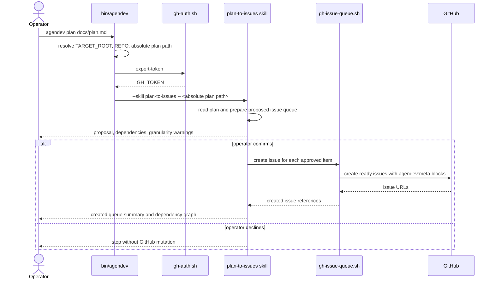
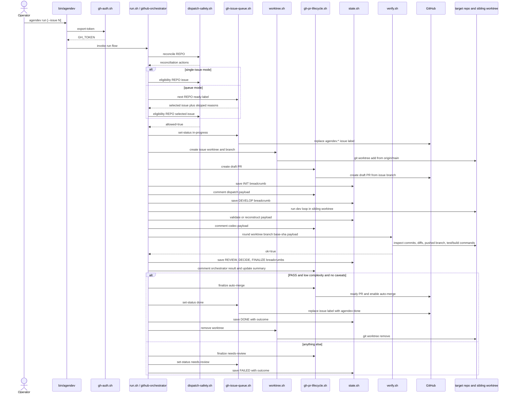
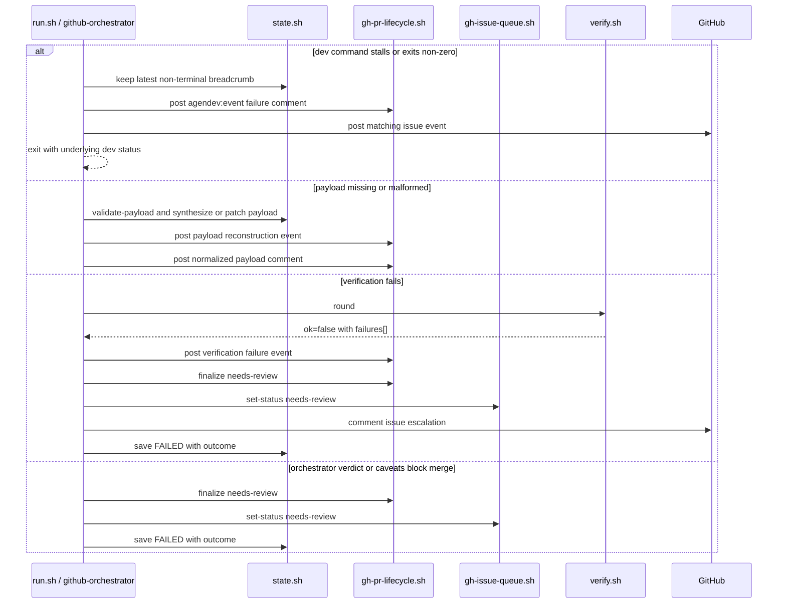
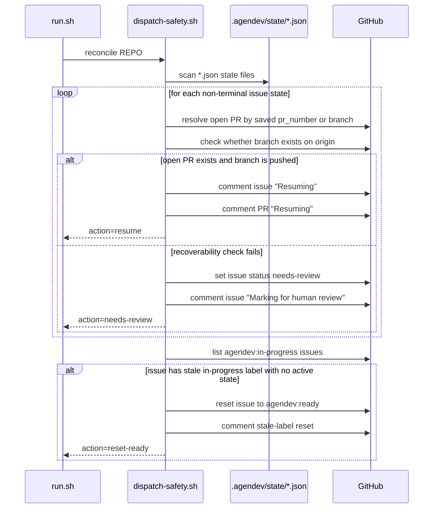
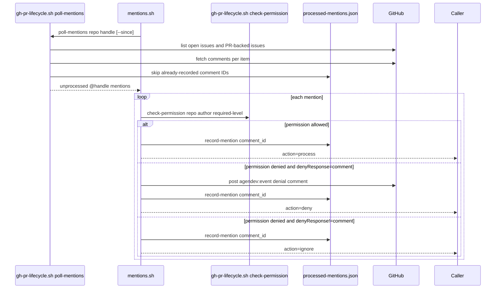
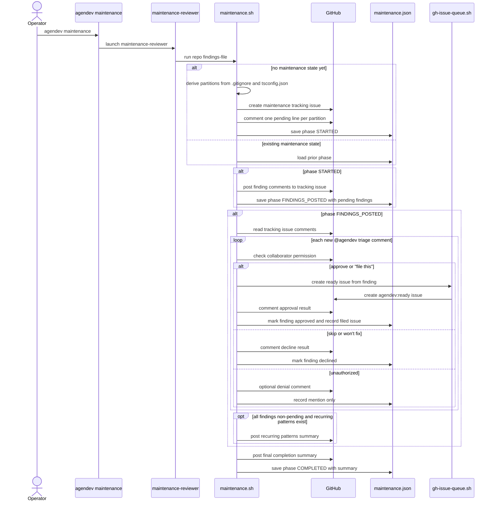

# Execution And Maintenance Flows

This document describes the major runtime sequences in `agendev`: planning, execution, reconciliation, mention handling, and maintenance review.

For `agendev run`, one detail matters: outside fixture mode, [`scripts/run.sh`](../../scripts/run.sh) delegates to the `github-orchestrator` agent after argument parsing. The detailed execution sequence below is therefore an implementation-backed inference from two sources taken together:

- the full scripted flow in fixture mode inside `scripts/run.sh`
- the hard rules and dispatch steps in `.claude/agents/github-orchestrator.md`

## `agendev plan`

`agendev plan <file>` is the plan-slicing entrypoint. The shell CLI resolves context and auth, then hands the local file to the `plan-to-issues` skill.

### Planning decision points

| Decision point | Current behavior |
| --- | --- |
| Plan granularity too broad, too narrow, or untestable | The skill must call that out before creation |
| User confirmation | No issues should be created before explicit confirmation |
| Issue creation path | The skill should use `gh-issue-queue.sh create`, not ad hoc `gh issue create` |

## `agendev run` Happy Path

The queue execution flow has two entry modes:

- `agendev run --issue N`: target a single issue directly
- `agendev run`: ask the queue for the next actionable ready issue

The sequence below shows the happy path for one issue after reconciliation succeeds.

### Finalization decision table

| Condition | Outcome |
| --- | --- |
| Verification passes, verdict is `PASS`, complexity is `low`, and caveats are empty | Auto-merge PR, mark issue `done`, save terminal state, remove worktree |
| Verification fails | Post verification failure event, mark issue `needs-human-review`, preserve state |
| Verdict is not `PASS` | Mark `needs-human-review` |
| Verdict is `PASS` but caveats are present | Mark `needs-human-review` |
| Verdict is `PASS` but issue complexity is not `low` | Mark `needs-human-review` |

## Failure And Escalation Path

The runtime is designed to stop safely and leave breadcrumbs when the happy path breaks.

### Queue-level stop condition

In queue mode, each non-completed issue increments the consecutive failure counter. When the counter reaches `consecutiveFailureLimit`:

- `run.sh` posts a circuit-breaker event naming the failed issues
- queue processing stops
- the command returns a JSON result with `status: "halted"` and `failed_issues`

## Startup Reconciliation And Resume

Every `run` starts with reconciliation. This is where the runtime decides whether it can resume an interrupted run or must escalate.

### Eligibility checks before dispatch

After reconciliation, `dispatch-safety.sh eligibility` can still reject an issue. It posts a skip comment and returns non-zero when any of these checks fail:

- acceptance criteria missing from the issue body
- any dependency is not labeled `agendev:done`
- an open PR already exists for the derived branch name
- the existing remote branch conflicts with `origin/main`

## Mention Polling And Authorization

Mention handling is used for maintenance triage and other bot-addressed comments. The control flow is intentionally permission-gated and deduplicated.

### Authorization decision points

| Decision point | Current behavior |
| --- | --- |
| Comment already recorded in `processed-mentions.json` | Skip it entirely |
| Mention does not contain `@<handle>` or is an audit payload/event comment | Skip it |
| Collaborator permission below `authorization.minimumPermission` | Deny with comment or ignore silently based on `authorization.denyResponse` |
| Permission sufficient | Return `action: "process"` and let the caller apply domain-specific logic |

## Maintenance Review And Triage

Maintenance review is a staged workflow implemented by `maintenance.sh`. It is read-only until a human triages findings through comments.

### Triage command interpretation

| Comment pattern | Effect |
| --- | --- |
| contains `approve` | file a queue issue and mark the finding approved |
| contains `file this` | same as approval |
| contains `lower priority` together with approval language | file the issue with priority override `3` |
| contains `skip` | mark finding declined |
| contains `won't fix` | mark finding declined |

### Maintenance resume behavior

`maintenance.sh run` resumes by phase:

- `STARTED`: post findings, then continue
- `FINDINGS_POSTED`: run triage, then complete
- `COMPLETED`: return saved summary without reposting the final completion comment
