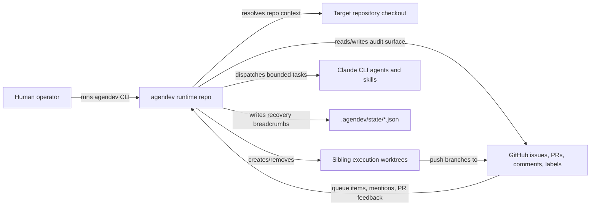
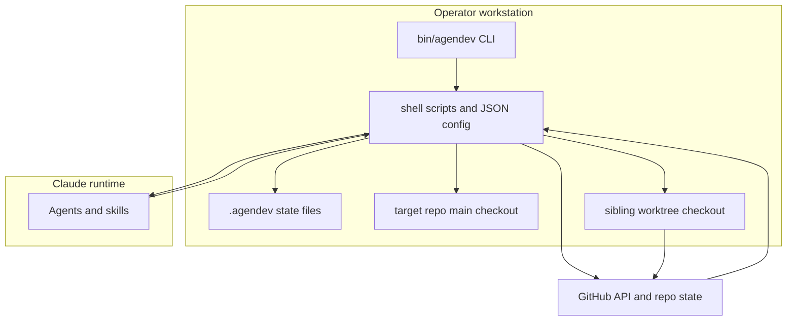
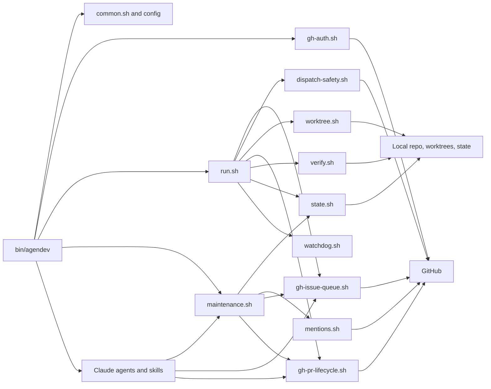

# Architecture Overview

This document describes the current `agendev` runtime as implemented in the repository today. It is the primary architecture reference for the shipped shell/runtime layer.

## System Context

`agendev` sits between a human operator, a target GitHub repository, and Claude-based agents. The operator invokes the CLI from inside the target repository. The runtime resolves repository context, authenticates to GitHub, manages queue and PR state through deterministic scripts, and delegates bounded reasoning work to agents and skills.

### External actors and systems

- Human operator: decides when to initialize a repo, confirm plan slicing, run the queue, inspect output, and triage maintenance findings.
- GitHub repository: hosts issues, PRs, labels, comments, collaborator permissions, and the long-lived operational audit trail.
- Claude CLI: runs the `plan-to-issues` skill plus the `github-orchestrator` and `maintenance-reviewer` agents.
- Target repository: provides the source tree, git remote, package scripts, `.gitignore`, and optional `tsconfig.json`.

## Container View

At runtime the system is split into a small set of containers with strict roles.

### Containers

| Container | Purpose | Primary implementation |
| --- | --- | --- |
| CLI entrypoint | Thin command router that resolves repo context and auth, then dispatches to scripts or Claude | `bin/agendev` |
| Deterministic shell runtime | Owns queue logic, PR lifecycle, auth, verification, maintenance operations, and recovery | `scripts/*.sh`, `config/agendev.json` |
| Agent layer | Performs plan slicing and bounded orchestration/review tasks around script contracts | `.claude/agents/*`, `.claude/skills/*` |
| GitHub control surface | Stores queue issues, PRs, labels, review comments, permissions, and audit comments | remote GitHub repo |
| Local breadcrumb state | Stores resumability state and processed-mention tracking | `.agendev/state/*.json` |
| Execution workspace | Holds the target repo main checkout plus sibling worktrees created per issue | target repo checkout and worktree siblings |

## Component View

The deterministic shell runtime is the architectural center of gravity. Prompted agents exist around it, not inside it.

### Component responsibilities

| Component | Owns | Does not own |
| --- | --- | --- |
| `bin/agendev` | Public CLI shape, repo context export, auth bootstrap, command routing | Queue logic, verification, PR mutation details |
| `scripts/gh-auth.sh` | GitHub token export, `GH_TOKEN` reuse, installation-token minting | Queue state, issue or PR decisions |
| `scripts/gh-issue-queue.sh` | Queue listing, metadata parsing, dependency ordering, label transitions, issue creation | PR lifecycle, verification, reconciliation |
| `scripts/dispatch-safety.sh` | Startup reconciliation, stale-label cleanup, eligibility checks, interrupted-run handling | PR creation, verification checks |
| `scripts/worktree.sh` | Branch naming, sibling worktree creation/removal | Queue selection, GitHub state |
| `scripts/gh-pr-lifecycle.sh` | Draft PR creation, audit comments, summary mutation, finalize actions, mention polling, permission checks | Queue ordering, local state transitions |
| `scripts/state.sh` | Atomic state writes, phase transition validation, payload extraction/normalization, processed-mention tracking | GitHub audit comments, verification commands |
| `scripts/verify.sh` | Ground-truth diff checks, branch push checks, test/build execution, payload consistency checks | Final PR or issue decisions |
| `scripts/run.sh` | End-to-end issue execution flow, queue loop, circuit breaker, audit comment sequencing | Complex review reasoning when not in fixture mode |
| `scripts/maintenance.sh` | Partition derivation, maintenance tracking issue lifecycle, findings storage, triage-to-issue filing | Code modification |
| `scripts/mentions.sh` | Mention polling, permission gating, deny comments, deduplication via state | Queue dispatch decisions |
| Claude skills and agents | Plan decomposition, bounded orchestration, maintenance review reasoning | Deterministic GitHub or filesystem contracts already defined in scripts |

## Boundaries And Responsibilities

### Deterministic layer vs prompt layer

The core architectural rule is that durable behavior belongs in shell scripts and JSON contracts, not in prompts.

- Scripts own queue ordering, label transitions, worktree paths, PR creation, verification gates, auth behavior, state transitions, mention authorization, and maintenance triage side effects.
- Agents and skills are intentionally thin. They consume typed inputs, make bounded decisions, and are expected to call repository scripts instead of issuing ad hoc `gh` commands.
- `run.sh` falls back to the `github-orchestrator` agent outside fixture mode, but the repository still treats the shell/runtime layer as the source of truth for auditable side effects.

### Audit trail vs recovery breadcrumbs

`agendev` uses two different persistence models on purpose:

- GitHub issues, PRs, and comments are the operational audit trail. Audit markers such as `<!-- agendev:event -->` and `<!-- agendev:payload:* -->` make those comments machine-recognizable and human-readable.
- `.agendev/state/*.json` is a resumability mechanism. State files track the latest local phase, worktree, PR number, timestamps, payload normalization output, and mention deduplication, but they are not the long-term record of operator actions.

### Working tree safety

The target repository main checkout is preserved. Execution work happens in sibling worktrees named from the issue number and title, created from `origin/main` by `scripts/worktree.sh`. Successful low-complexity runs remove their worktrees after finalization.

## Source-Of-Truth Rules

- GitHub labels and issue metadata define queue eligibility and dependency ordering.
- GitHub PR and issue comments are the durable record of dispatch, verification, escalation, and maintenance activity.
- `config/agendev.json` defines labels, auth policy, reviewer defaults, branch/worktree prefixes, verification commands, and queue safety limits.
- `.agendev/identity.json` and `GH_TOKEN` determine which GitHub identity is used.
- `.agendev/state/*.json` and `processed-mentions.json` exist to recover and reconcile local execution, not to replace GitHub history.
- The target repository defines test/build commands indirectly through `config/agendev.json` and supplies the actual code and git remotes the runtime acts on.

## Architectural Constraints And Tradeoffs

- Shell-first runtime: easier to test and recover, but shell contracts must stay narrow and stable.
- GitHub as control plane: gives operators a visible audit trail, but couples runtime behavior to GitHub issue/PR semantics and permissions.
- Sibling worktrees: protect the target checkout, but require extra cleanup and branch reconciliation logic.
- Local breadcrumb state: enables resume and stale-run detection, but must never be confused with the system audit trail.
- Thin prompts: reduce hidden logic, but require more up-front script design whenever a behavior needs to be stable or testable.

## Ownership Summary

Use this table when deciding where a change belongs:

| Concern | Owning layer |
| --- | --- |
| Queue logic and dependency ordering | `gh-issue-queue.sh`, `dispatch-safety.sh`, `run.sh` |
| PR lifecycle | `gh-pr-lifecycle.sh`, `run.sh` |
| Auth and token minting | `gh-auth.sh`, `.agendev/identity.json`, `GH_TOKEN` |
| Verification | `verify.sh` plus configured test/build commands |
| Maintenance review and triage | `maintenance.sh`, `mentions.sh`, `maintenance-reviewer` |
| State handling and payload reconstruction | `state.sh` |
